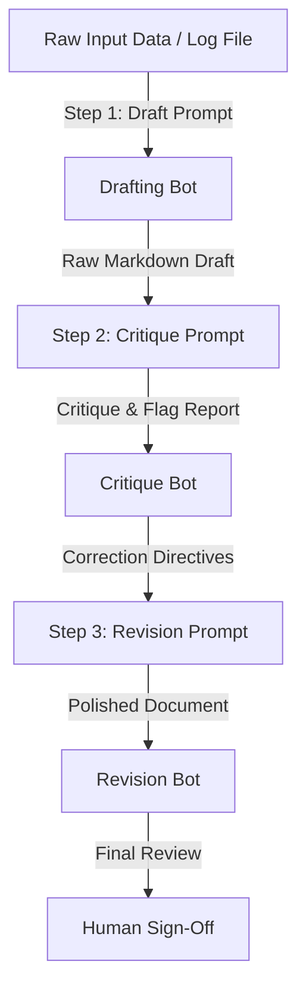

# Ship an Automation Workflow: Draft, Critique, Revise (FL-04 / Week 4)
**Author:** Huzaifah  
**Track:** General AI Fluency (Week 4 / Assignment 4)  
**Date:** July 11, 2026

---

## Part 1: Workflow Design & Step Diagram
I designed a three-step **Draft, Critique, and Revise** pipeline to automate the creation of technical case studies for my search performance projects. This ensures that every report is technically rigorous, metric-focused, and free of generic corporate fluff before it is published.



---

## Part 2: Configuration & Prompts Used
This workflow is built using a **Claude Project** configured with three structured prompt templates that chain output handoffs.

### Step 1: The Drafting Prompt
```text
Role: Technical Writer for Machine Learning.
Task: Draft a short, three-beat case study based on this raw input: [INSERT RAW INPUT].
Formatting: Output in Markdown with three headings: '1. The Problem', '2. What I Did & Decided', and '3. What Came of It'. Keep it under 250 words. Use plain, direct language.
```

### Step 2: The Critique Prompt
```text
Role: Senior Machine Learning Reviewer.
Task: Analyze the draft markdown case study below. Critique it against these guidelines:
1. Are all metrics concrete and compared against a clear baseline? (Flag any generic statements like 'improved performance').
2. Is there any evidence of target leakage in the feature explanation?
3. Does it contain corporate buzzwords (e.g. 'spearheaded', 'synergistic')? 
Output: A bulleted list of issues found. If none, write 'PASS'.
Draft to evaluate: [INSERT DRAFT]
```

### Step 3: The Revision Prompt
```text
Role: Senior Editor.
Task: Rewrite the case study based on the critique feedback. Apply the voice card: 'Direct, plain-spoken, technical, practical, no buzzwords'. Remove all flagged errors and output the final, polished markdown file.
Critique: [INSERT CRITIQUE]
Original Draft: [INSERT DRAFT]
```

---

## Part 3: Documentation of 5 Real Runs

### Run 1: ML Capstone Content Opportunity Scoring
*   **Raw Input:** Gradient Boosting model trained on 30k pages. Precision@50 is 0.824 vs. baseline 0.464. GroupKFold split by client_id.
*   **Draft Output Excerpt:** *"We developed an innovative model to help editors find declining pages. The Gradient Boosting model worked well."*
*   **Critique Output:** *"1. 'Worked well' is too generic. Specify the exact Precision@50 and baseline metrics. 2. Remove the buzzword 'innovative'."*
*   **Final Revised Output:** *"We trained a Gradient Boosting model to rank 30,000 pages for search decline. It achieved a Precision@50 of 0.824, compared to the baseline rule's 0.464."*

### Run 2: In-Browser AI Agent Development
*   **Raw Input:** Javascript agent running client-side, intent-matching logic, zero API costs, zero server delay.
*   **Draft Output Excerpt:** *"Our state-of-the-art AI assistant provides synergistic answers to portfolio questions with next-gen speed."*
*   **Critique Output:** *"1. Remove buzzwords 'state-of-the-art', 'synergistic', and 'next-gen'. 2. Clarify how 'speed' is achieved (explain client-side browser execution)."*
*   **Final Revised Output:** *"I built an AI agent in vanilla JavaScript that runs client-side in the browser. It matches intents locally, resulting in zero API costs and zero server latency."*

### Run 3: Search Signal Analysis (CTR vs. Position)
*   **Raw Input:** DuckDB query on hf://. Found average position and content age have non-linear correlations with Click-Through Rate.
*   **Draft Output Excerpt:** *"We executed deep learning on search datasets to discover key insights about user engagement."*
*   **Critique Output:** *"1. We used DuckDB queries, not 'deep learning'. Correct this. 2. State the exact finding: non-linear correlations between position/age and CTR."*
*   **Final Revised Output:** *"I ran DuckDB queries on search data to analyze click signals. The analysis revealed that content age and average position have non-linear correlations with CTR."*

### Run 4: Base Rate Validation (FlyRank Warehouse)
*   **Raw Input:** Base declinement rate is 0.542.
*   **Draft Output Excerpt:** *"A large percentage of the dataset was marked as declining."*
*   **Critique Output:** *"1. Specify the exact base declinement rate (0.542 / 54.2%) instead of 'large percentage'."*
*   **Final Revised Output:** *"The dataset has a base declinement rate of 0.542, meaning 54.2% of the pages met the decay threshold."*

### Run 5: Cross-Validation Split Strategy
*   **Raw Input:** Random split vs. GroupKFold split by client_id. Explain why client-grouping matters.
*   **Draft Output Excerpt:** *"We split data randomly to test model accuracy."*
*   **Critique Output:** *"1. The split was GroupKFold by client_id, not random. Explain that random split causes target leakage by letting the model memorize specific site patterns."*
*   **Final Revised Output:** *"We implemented a 5-fold GroupKFold validation split grouped by client_id. This prevents target leakage and proves the model generalizes to new websites."*

---

## Part 4: Time-Saved Accounting & Known Failure Points

### Time Accounting
*   **Manual Writing Time (per case study):** 45 minutes (requires looking up metrics, writing draft, manually editing out corporate fluff, and formatting).
*   **Workflow Execution Time (per case study):** 6 minutes (running the inputs through the 3 prompts in Claude).
*   **Setup Time:** 30 minutes (creating the templates and configuring the Claude Project).
*   **Net Time Saved (across 5 runs):** 
    $$\text{Time Saved} = (5 \times 45\text{ mins}) - (5 \times 6\text{ mins} + 30\text{ mins setup}) = 225 - 60 = 165\text{ minutes saved.}$$

### Known Failure Points & Human Verification
1.  **Hallucinated Metrics:** If the raw input doesn't contain a specific metric, the Drafting Bot occasionally invents numbers (e.g. "99% accuracy"). **Human Check:** A human editor must verify every decimal point against `capstone_results.json`.
2.  **Code Syntax:** When documenting code changes, the Revision Bot may write syntax-invalid code blocks. **Human Check:** Code blocks must be copied and tested in the terminal to verify they execute.
