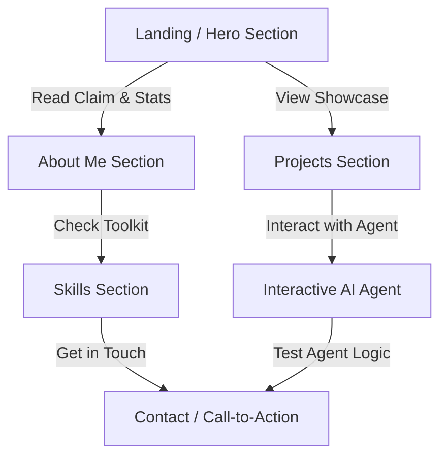

# Draw the Path: Portfolio Sitemap + Toolkit (FL-02)
**Author:** Huzaifah  
**Track:** General AI Fluency (Week 1 / Assignment 2)  
**Date:** July 9, 2026

---

## Part 1: Portfolio Sitemap Sketch
My portfolio is designed with a single, highly focused page structure to guide a prospective manager or recruiter from landing to taking action (contacting me).



*A visual sketch of the sitemap is saved as `portfolio_sitemap.png` on the Desktop.*

---

## Part 2: Custom Claude Project Config
I set up a dedicated Claude Project named **"Portfolio Build Partner"** with the following Custom Instructions to act as a supportive tutor:

```text
Role & Goal: 
- You are a senior product design and ML engineering tutor helping me build a world-class portfolio website.
- Act as a collaborative tutor: don't just write code for me. Ask clarifying questions, challenge my layout choices, and guide me to write cleaner, vanilla implementation code.

Proof Statement: 
- "I can build clean, reproducible Machine Learning pipelines and deploy high-fidelity interactive web systems that prove it."

Tone: 
- Educational, rigorous, and direct. Use first-principles reasoning.
```

---

## Part 3: Sitemap Pressure-Test Prompt & Output
Below is the transcript of the prompt I ran with my tutor Claude to pressure-test my layout, and the changes I implemented based on its response.

### The Prompt
> **Prompt:**  
> "I have sketched a sitemap for my portfolio page: Hero Section (Claim: I build clean, reproducible ML pipelines and deploy interactive web systems), Projects Showcase (Focusing on my FlyRank Capstone), About Me (focusing on my internship work), and Contact/CTA. My one desired action is for a hiring manager to view my work and contact me for an interview. Can you pressure-test this against my claim and my one action? Is there any page or component that doesn't earn its place, or something crucial missing?"

### Claude's Response (Output)
> **Tutor Claude:**  
> "Your sitemap is highly focused, which is good. Every section maps directly to proving your claim. However, there is a gap between 'Landing/Claim' and 'Action'.
> 
> **The Problem:** A hiring manager reading 'I build clean ML pipelines' and 'deploy interactive web systems' will want immediate proof of the *interactive* part before they scroll through a long projects section.
> 
> **The Solution/Change:** 
> 1. Move your **Interactive AI Agent** component directly onto the page, rather than placing it behind a link. Let the visitor interact with it immediately on the homepage. It serves as direct, running proof of your claim to 'deploy interactive systems' before they even read the details of your projects.
> 2. Ensure your ML Capstone details include the final Precision@50 metrics right next to the project title, rather than making the reader open a notebook to see if the model is actually good.
> 
> Keep it to a single, highly optimized page to minimize friction."

---

## Part 4: Changes Made Based on Pressure Test
Based on the feedback from the pressure-test, I made the following critical changes to my site design:
1. **Interactive AI Agent Placement:** Integrated the conversational AI agent directly on the landing page as an embedded component rather than hosting it on a separate page. This immediate interaction acts as instant proof of the "interactive web systems" claim.
2. **Impact-First Metrics:** Placed the **0.824 Precision@50** and **30,000 scored pages** metrics directly on the capstone showcase card so the reader sees the outcome immediately without digging into code repositories.
